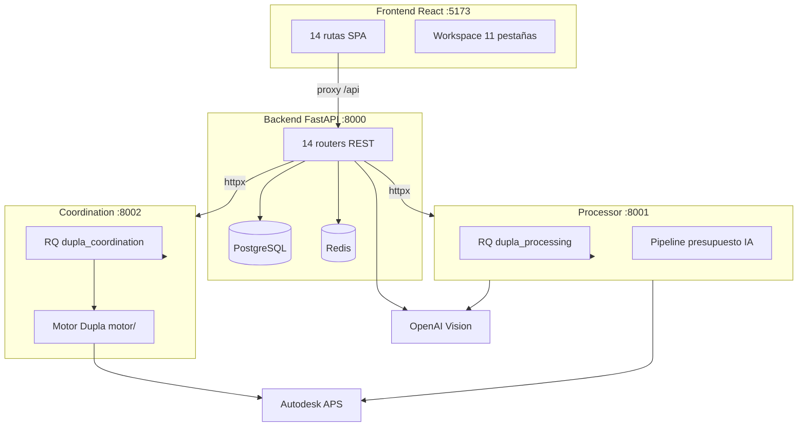
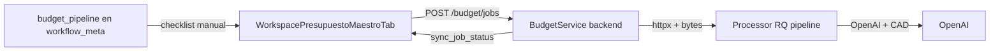

# Informe completo — Estructura funcional Dupla Native

**Fecha:** 17 de junio de 2026  
**Repositorio:** `dupla-native`  
**Alcance:** Arquitectura, estado funcional por módulo (óptimo / mediano / simulado), integraciones externas, errores graves, completitud por etapa, verificación de clashes y presupuestos.  
**Método:** Análisis estático del código, documentación interna, verificación runtime del entorno local (17-jun-2026), ejecución de tests automatizados y evidencia E2E NASAS 09 (`scripts/test_clash_nasas09.py --rerun`).

---

## 1. Resumen ejecutivo

**Dupla** es una plataforma web monorepo para equipos de arquitectura y obra. Integra ciclo de vida del proyecto, repositorio documental (DWG/DXF/PDF), chat, tablero Kanban, pliegos GA-FO, presupuesto con IA, detección de clashes geométricos y administración por roles.

| Indicador | Valor |
|-----------|-------|
| **Completitud global estimada** | **77 / 100** |
| Servicios del monorepo | 4 aplicaciones + 2 workers RQ |
| Routers API backend | 14 |
| Rutas SPA frontend | 14 |
| Pestañas del workspace | 11 |
| Tests automatizados (local, 17-jun-2026) | **138** backend · **93** processor · **5** frontend · **8** motor · **4** coordination = **248** |

### Veredictos clave (preguntas directas)

| Pregunta | Respuesta |
|----------|-----------|
| **¿Los clashes están simulados?** | **No**, en el entorno verificado. `COORDINATION_SMOKE_MODE=false` y el último E2E reportó `analysis_mode: "real"`. Existe modo **simulado opt-in** con fixtures JSON cuando `COORDINATION_SMOKE_MODE=true`. |
| **¿La detección de clashes funciona?** | **Sí, de forma real y parcialmente madura.** El motor Dupla (`motor/`) + APS + volcado Viewer SVF1 detectó **30 incidencias** en NASAS 09 (~41 min con caché). Calidad geométrica **mediana**: 3/4 DWG con geometría exacta; ARQ falló extracción; varios clashes aún mezclan `pdf_companion_vector`. |
| **¿Los presupuestos funcionan?** | **Parcialmente (mediano).** La tubería backend → processor → UI está cableada y probada con tests. **Sin `OPENAI_API_KEY` en `.env` local**, el presupuesto maestro IA y la clasificación enriquecida quedan degradados. El checklist operativo manual (Postgres) sí funciona. |
| **¿APIs externas OK?** | PostgreSQL, Redis, Processor, Coordination y **Autodesk APS (OAuth)** operativos. **OpenAI y SMTP no configurados** en el `.env` local verificado. **Supabase no se usa** en este proyecto. |

### Estado runtime verificado (17-jun-2026)

| Servicio | Puerto | Estado |
|----------|--------|--------|
| PostgreSQL | 5432 | **UP** |
| Redis | 6379 | **UP** |
| Backend FastAPI | 8000 | **UP** (`/docs` → 200) |
| Processor | 8001 | **UP** (`/health` → 200) |
| Coordination-service | 8002 | **UP** (`/health` → 200) |
| Frontend Vite | 5173 | **UP** |
| Workers RQ | — | processor-worker y coordination-worker **UP** |

---

## 2. Arquitectura funcional

### 2.1 Diagrama de componentes



### 2.2 Stack tecnológico

| Capa | Tecnologías |
|------|-------------|
| Frontend | Vite 8, React 19, TypeScript, Tailwind CSS 4, Zustand, Zod, React Router 7 |
| Backend | FastAPI, SQLAlchemy 2 async, Alembic, Pydantic 2, asyncpg, JWT, bcrypt |
| Datos | PostgreSQL 16+, Redis 7+ |
| Processor | FastAPI, RQ worker, OpenAI, PyMuPDF, NumPy, disciplinas CAD |
| Coordination | FastAPI, RQ worker, ezdxf, Shapely, motor en `motor/` |
| Orquestación local | `scripts/dev.sh` (setup, bootstrap, start, stop, status) |

### 2.3 Estructura del monorepo

```
dupla-native/
├── backend/                 # API REST, reglas de negocio, Alembic
├── frontend/                # SPA React (workspace 11 pestañas)
├── processor/               # Presupuesto IA, visión PDF, takeoff CAD
├── coordination-service/    # Encolado y wrapper de clash analysis
├── motor/                   # Motor geométrico Dupla + aps_integration
├── docs/                    # Documentación de producto y técnica
├── scripts/                 # dev.sh, test_clash_nasas09.py, etc.
└── var/                     # uploads, cache APS, artifacts (gitignored)
```

### 2.4 Routers API (backend)

| Router | Área funcional |
|--------|----------------|
| `auth` | Login JWT, tokens, reset password |
| `users` | Perfil, notificaciones |
| `ai_assistant` | Asistente IA flotante |
| `modules` | Catálogo de módulos producto |
| `projects` | CRUD, exports, hallazgos técnicos |
| `budget` | Jobs presupuesto maestro IA |
| `clash` | Jobs detección de clashes |
| `clash_workflow` | Workflow post-clash (correcciones, reanálisis) |
| `workflow_templates` | Plantillas de flujo editables |
| `project_lifecycle` | Archivos, fases, bootstrap, pliego, base precios |
| `admin` | Usuarios, workspaces |
| `dashboard` | KPIs Gerencia |
| `chat` | Mensajería |
| `tasks` | Tablero Kanban |

---

## 3. Clasificación por nivel de madurez

Leyenda:

| Nivel | Significado |
|-------|-------------|
| **Óptimo** | Flujo end-to-end estable, datos reales, UX coherente con backend |
| **Mediano** | Funcional con limitaciones, datos parciales o dependencia de config externa |
| **Simulado** | Fixtures, smoke mode o datos hardcodeados que no reflejan producción |

| Módulo / feature | Nivel | Notas |
|------------------|-------|-------|
| Auth JWT + sesión | **Óptimo** | Login, guards, cambio de contraseña |
| Reset password por email | **Simulado / roto sin SMTP** | `SMTP_HOST` vacío; solo QA con `DEV_EXPOSE_RESET_TOKEN` |
| CRUD proyectos y carpetas | **Óptimo** | Estable, multi-workspace |
| Subida y versionado de archivos | **Óptimo** | DWG/PDF/DXF en Postgres + disco |
| Workflow por fases (GA-FO) | **Mediano** | Lineal; sub-estados IA aún mezclados |
| Clasificación IA de archivos | **Mediano / degradado** | Sin OpenAI: heurística nombre/MIME |
| Bootstrap checklist proyecto | **Mediano** | Manual + flags; no valida takeoff real automáticamente |
| Pliego GA-FO (especificaciones) | **Mediano–óptimo** | Edición, aprobación, chat contextual |
| Revisión arquitectura | **Mediano** | Tab revisiones operativa |
| **Detección de clashes** | **Mediano (motor real)** | No simulado; precisión geométrica en mejora (Plan A NASAS) |
| Export GA-FO-08 PDF | **Mediano–óptimo** | E2E generó PDF >100 KB; campos menores vs referencia |
| Hallazgos / informe estructural | **Mediano** | Badges geometría, confianza y fuentes recién añadidos |
| Workflow post-clash | **Mediano** | Estados y correcciones OK; reanálisis **no re-ejecuta motor** |
| Presupuesto checklist (Flujo tab) | **Mediano** | Manual; sync parcial con processor |
| Presupuesto maestro IA | **Mediano / degradado** | Pipeline real pero **requiere OpenAI** |
| Base de precios | **Mediano** | Upload BC3/Excel; enriquecimiento IA condicionado |
| Chat proyecto / pliego | **Mediano** | Funcional; historial de 500 intermitente reportado |
| Tablero Kanban | **Óptimo** | CRUD tareas, estados |
| Dashboard Gerencia | **Mediano** | KPIs parciales |
| Admin usuarios / workspaces | **Mediano–óptimo** | CRUD estable |
| Asistente IA flotante | **Mediano / degradado** | Depende OpenAI |
| DevOps / CI | **Mediano** | CI backend+processor+frontend; motor/coord fuera de CI principal |
| Modo smoke clashes | **Simulado (opt-in)** | Solo si `COORDINATION_SMOKE_MODE=true` |

---

## 4. Completitud por etapa principal (%)

Estimación ponderada sobre el documento de negocio y el roadmap interno (`docs/ROADMAP_COMPLETITUD_100.md`), actualizada con trabajo NASAS 09 (geometría SVF1).

| Etapa / dominio | % | Tendencia | Comentario |
|-----------------|---|-----------|------------|
| 1. Auth y sesión | **95%** | → | Falta verificar SMTP en staging |
| 2. Proyectos y archivos | **88%** | → | Sólido |
| 3. Clasificación / bootstrap IA | **58%** | ↓ local | OpenAI vacío en `.env` |
| 4. Revisión arquitectura | **85%** | → | |
| 5. Pliego / especificaciones GA-FO | **82%** | → | |
| 6. **Detección de clashes** | **78%** | ↑ | Motor real; Plan A 3/4 DWG exactos en E2E |
| 7. Informes y exports (GA-FO-08, tiles) | **80%** | ↑ | PDF E2E OK |
| 8. Presupuesto operativo (checklist) | **65%** | → | Desacoplado del takeoff |
| 9. Presupuesto maestro IA | **68%** | ↓ local | Sin API key OpenAI |
| 10. Base de precios | **75%** | → | |
| 11. Chat y colaboración | **88%** | → | |
| 12. Tablero / eventos | **88%** | → | |
| 13. Admin / dashboard | **72%** | → | |
| 14. DevOps / producción | **62%** | → | Sin deploy CI automatizado |

### Completitud global

```
Promedio ponderado (etapas críticas de producto): 77 / 100
```

Interpretación: el producto es **usable en desarrollo** para flujos reales de coordinación y obra, pero **no está listo para producción comercial** sin resolver SMTP, OpenAI en entornos objetivo, CI ampliado y deuda en presupuesto/clash workflow.

---

## 5. Features que funcionan vs. las que no

### 5.1 Funcionando correctamente (evidencia)

| Feature | Evidencia |
|---------|-----------|
| Login JWT y navegación SPA | `/docs` + rutas protegidas |
| Subida DWG/PDF por proyecto | E2E NASAS sube 4 planos |
| Encolado clash job | `POST .../clash/jobs` → worker RQ |
| **Detección real de clashes** | 30 incidencias, `analysis_mode: "real"`, fuentes `dwg_aps_viewer_2d` |
| Extracción APS + OAuth | Token APS obtenido (len 886) en verificación |
| Geometría exacta SAN/ELC/EST (parcial) | `viewer_elements`: 350/350/81 en último reporte |
| Export PDF GA-FO-08 | 156 MB generado; validador estructural OK |
| UI Hallazgos: badges geometría, confianza | `WorkspaceHallazgosTab.tsx` + API enrich |
| Presupuesto: encolar job y polling | `BudgetService`, `useBudgetJob`, tests backend |
| Guard `base_extraction` no marca volumetría | `test_budget_pipeline_sync.py` |
| Pliego editable por fase | Guards `isPliegoEditablePhase` |
| Kanban tareas | Router `tasks` + `TaskboardPage` |
| Tests automatizados | 248 tests passed localmente |

### 5.2 Funcionando parcialmente o con limitaciones

| Feature | Problema |
|---------|----------|
| Clashes DWG↔DWG puros | ARQ sin extracción (`aps_result: empty`); muchos pares ARQ↔EST usan `pdf#page` |
| Multi-vista ARQ | Solo 5 elementos viewer; dump multi-vista en progreso |
| Reanálisis de clash | Registra estado; **no relanza motor Dupla** |
| Presupuesto maestro IA | Requiere `OPENAI_API_KEY` (vacía localmente) |
| Clasificación GA-FO por contenido | Degradada a nombre/MIME sin OpenAI |
| Checklist presupuesto vs takeoff | Usuario puede marcar hitos sin job processor válido |
| Dashboard KPIs | Cobertura parcial vs doc de negocio |
| Informe técnico automático | Solo informe documental PDF heurístico |

### 5.3 No funcional o simulado en el entorno actual

| Feature | Estado |
|---------|--------|
| Reset password por correo | **No funcional** (SMTP vacío) |
| Clashes en smoke mode | **Simulado** (opt-in, desactivado en dev) |
| Supabase | **No aplica** (no integrado) |
| Deploy producción automatizado | **No implementado** |

---

## 6. Integraciones externas — verificación

Verificación ejecutada el 17-jun-2026 contra `backend/.env` y servicios locales.

| Integración | Requerida | Config local | Runtime | Veredicto |
|-------------|-----------|--------------|---------|-----------|
| **PostgreSQL** | Sí | `DATABASE_URL` | `SELECT 1` OK | **Óptimo** |
| **Redis** | Sí | `REDIS_URL` | `PING` OK | **Óptimo** |
| **Processor :8001** | Sí | `PROCESSOR_URL` | `/health` 200 | **Óptimo** |
| **Coordination :8002** | Sí | `COORDINATION_URL` | `/health` 200 | **Óptimo** |
| **Motor `motor/`** | Sí (clashes) | `DUPLA_ROOT` | En monorepo | **Mediano** (tests 8; CI parcial) |
| **Autodesk APS** | Clashes + CAD | `CLIENT_ID`, `CLIENT_SECRET`, bucket | OAuth token OK | **Óptimo** |
| **Google Chrome** | Dump Viewer SVF1 | `PUPPETEER_EXECUTABLE_PATH` | Usado en E2E | **Óptimo** (macOS local) |
| **OpenAI** | Presupuesto IA, visión, chat | `OPENAI_API_KEY=` **vacía** | No probado | **No operativo local** |
| **SMTP** | Reset password prod | `SMTP_HOST=` **vacío** | No probado | **No operativo local** |
| **Supabase** | — | No referenciado | — | **N/A** |

---

## 7. Errores graves y riesgos

### 7.1 Seguridad y producción

| ID | Severidad | Problema | Ubicación |
|----|-----------|----------|-----------|
| S1 | **Alta** | Reset password falla silenciosamente sin SMTP | `backend/app/services/email_service.py` |
| S2 | **Alta** | `JWT_SECRET` demo en development | `backend/app/config.py` |
| S3 | **Media** | Sin pipeline deploy CI | `.github/workflows/` |
| S4 | **Media** | `COORDINATION_SMOKE_MODE=true` en staging bloqueado por config, pero puede confundir QA en dev | `coordination-service/wrapper/run_clash_analysis.py` |

### 7.2 Funcionalidad engañosa o rota

| ID | Severidad | Problema | Impacto |
|----|-----------|----------|---------|
| F1 | **Alta** | Reanálisis clash no re-ejecuta motor | Usuario cree que re-detectó interferencias |
| F2 | **Alta** | Presupuesto IA sin OpenAI parece “disponible” pero falla o vacía | UX engañosa |
| F3 | **Media** | Checklist presupuesto manual sin validar takeoff processor | Fases avanzan con datos incompletos |
| F4 | **Media** | Clasificación IA solo nombre/MIME sin OpenAI | Archivos mal disciplinados |
| F5 | **Media** | ARQ NASAS09 `aps_result: empty` en último E2E | Clashes ARQ dependen de PDF compañero |
| F6 | **Media** | Clashes con `pdf_companion_vector` mezclados con DWG exacto | Confianza medium, no 100% DWG↔DWG |

### 7.3 Deuda técnica

| ID | Problema |
|----|----------|
| D1 | CI no ejecuta motor ni coordination-service de forma obligatoria |
| D2 | Frontend: 5 tests Vitest vs 11 pestañas workspace |
| D3 | E2E clash ~40 min; criterios Plan A aún no pasan 4/4 DWG |
| D4 | Backend sin endpoint `/health` dedicado (solo `/docs`) |

---

## 8. Detección de clashes — análisis detallado

### 8.1 ¿Simulada o real?

| Modo | Condición | Comportamiento |
|------|-----------|----------------|
| **Real** | `COORDINATION_SMOKE_MODE=false` (default en `scripts/dev.sh`) | Invoca `run_nasas09_project_coordination.py`, motor Shapely, APS, volcado Viewer |
| **Simulado** | `COORDINATION_SMOKE_MODE=true` | Carga fixtures `smoke_primary_incidents.json`; `analysis_mode: "smoke"` |

**Entorno verificado:** `COORDINATION_SMOKE_MODE=false` → **detección REAL**.

### 8.2 Evidencia E2E NASAS 09 (17-jun-2026, `--rerun`)

| Métrica | Resultado |
|---------|-----------|
| Duración | 2 476 s (~41 min) |
| Clashes detectados | **30** |
| `analysis_mode` | **real** |
| GA-FO-08 PDF | 156 787 437 bytes (estructura OK) |
| DWG geometría exacta | **3/4** (EST 81, ELC 350, SAN 350 viewer elements) |
| ARQ | `aps_result: empty`, 0 viewer elements |
| Fuentes geom. dominantes | `pdf_companion_vector / dwg_aps_viewer_2d` (ARQ↔EST) |

### 8.3 Calidad actual del motor

| Aspecto | Estado |
|---------|--------|
| Pipeline end-to-end | **Funciona** |
| Geometría SVF1 + Chrome | **Funciona** (Plan A en progreso) |
| Skip PDF companion en clash | **Implementado** (cuando DWG exacto ≥10 elems) |
| Multi-vista ARQ/EST | **Parcial** (env `APS_VIEWER_MAX_VIEWS=4`) |
| Confianza en UI | **Implementada** (`confidence`, `geometry_sources`) |
| Cobertura 4/4 planos exactos | **Pendiente** (ARQ bloqueado) |

**Veredicto clashes:** **Funcionamiento real, calidad mediana-alta en camino a óptimo.** No es demo simulada; los resultados provienen del motor Dupla y APS. Aún hay deuda en precisión geométrica ARQ y reducción de dependencia del PDF compañero.

---

## 9. Presupuestos — análisis detallado

### 9.1 Arquitectura (dos capas)



### 9.2 Componentes

| Capa | Rol | Estado |
|------|-----|--------|
| **Checklist operativo** | Hitos en pestaña Flujo (`subcontracts_done`, `volumetry_done`, etc.) | **Mediano** — manual |
| **Presupuesto maestro IA** | `POST /api/projects/{uuid}/budget/jobs` → processor | **Mediano** — pipeline real |
| **Sync volumetría** | Job `completed` con filas y `mode != base_extraction` | **Óptimo** (guard + tests) |
| **UI Presupuesto maestro** | Tabla filas, polling, disciplinas | **Mediano–óptimo** |
| **Base de precios** | Tab dedicada, upload BC3 | **Mediano** |

### 9.3 Verificación local

| Check | Resultado |
|-------|-----------|
| Rutas `budget.py` | Presentes (enqueue, latest, result) |
| Tests `test_budget_pipeline_sync.py` | Passed (base_extraction no califica volumetría) |
| Processor tests presupuesto | `test_budget_fixes_abcd.py` y pipeline dedup |
| `OPENAI_API_KEY` en `.env` | **Vacía** → presupuesto IA **no verificable end-to-end hoy** |

**Veredicto presupuestos:** **Funcional en infraestructura (mediano).** No está simulado: el processor ejecuta pipeline real cuando hay API key y archivos. En el entorno local actual **el presupuesto maestro IA está degradado** por falta de OpenAI. El checklist manual funciona pero **no garantiza integridad** con el takeoff automático.

---

## 10. Tests y calidad

| Suite | Tests | Estado 17-jun-2026 |
|-------|-------|---------------------|
| Backend | 138 | **Passed** |
| Processor | 93 | **Passed** |
| Frontend (Vitest) | 5 | **Passed** |
| Motor coordination | 8 | **Passed** |
| Coordination-service | 4 | **Passed** |
| **Total** | **248** | **Passed** |
| E2E clash NASAS09 | Script manual | **Parcial** (30 clashes; criterios Plan A 3/4) |

---

## 11. Recomendaciones prioritarias

1. **Configurar `OPENAI_API_KEY`** en `.env` y verificar un job presupuesto completo end-to-end.
2. **Configurar SMTP** o documentar flujo QA con `DEV_EXPOSE_RESET_TOKEN` solo en dev.
3. **Resolver extracción ARQ** (`aps_result: empty`) — revisar traducción APS / volcado multi-vista.
4. **Completar Plan A NASAS**: 4/4 DWG exactos, clashes SAN↔ELC DWG puro, menos `pdf_companion_vector`.
5. **Reanálisis clash honesto**: endpoint que re-encole job o documentar que solo actualiza workflow.
6. **Ampliar CI** con motor + coordination-service + smoke E2E opcional.
7. **Añadir `/health` al backend** para monitoreo uniforme.

---

## 12. Conclusión

Dupla Native se encuentra aproximadamente al **77%** de completitud respecto al producto objetivo descrito en la documentación interna. La plataforma **funciona de verdad** en autenticación, proyectos, archivos, workflow, pliego, kanban y **detección de clashes reales** vía motor Dupla + APS. Varios módulos operan en modo **mediano**: presupuesto IA, clasificación, dashboard y precisión geométrica de clashes. El modo **simulado** existe únicamente para clashes (`COORDINATION_SMOKE_MODE`) y **no está activo** en el entorno verificado.

La detección de clashes **no está simulada** — está **operativa con calidad mediana** y mejoras activas (Plan A geometría SVF1). Los presupuestos **funcionan a nivel de plataforma** pero el **presupuesto maestro IA requiere OpenAI**, ausente en la configuración local actual.

---

*Informe generado a partir de código fuente, tests automatizados, verificación runtime y corrida E2E NASAS 09 del 17-jun-2026.*
