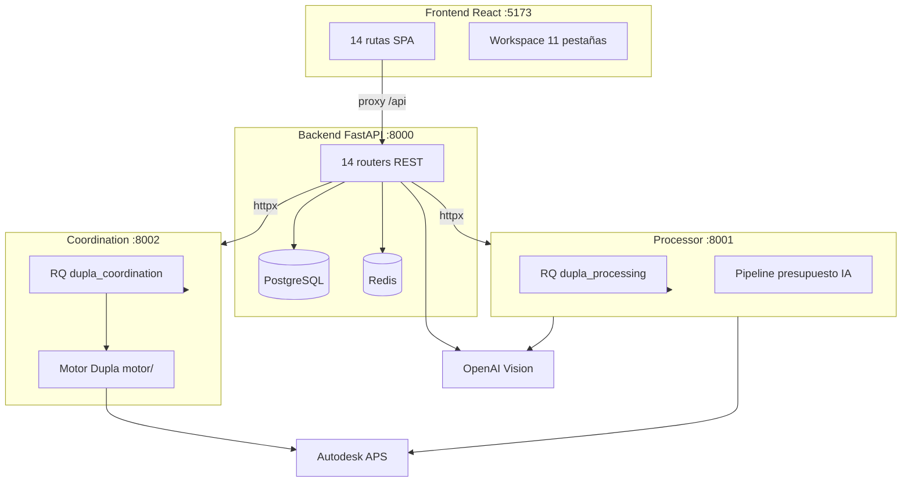
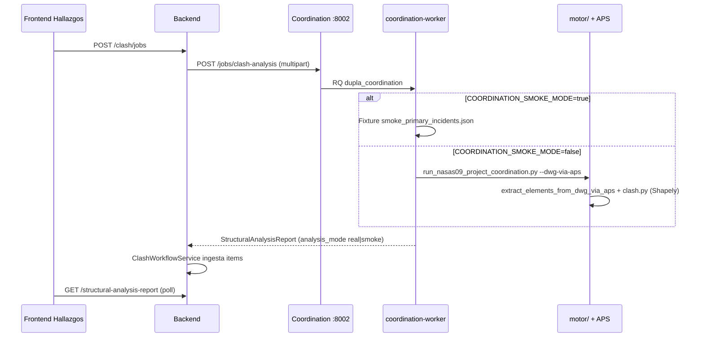
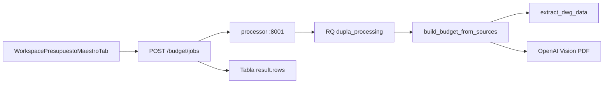

# Informe completo — Estructura funcional Dupla Native

**Fecha:** 15 de junio de 2026 (actualizado con verificación runtime)  
**Repositorio:** `dupla-native`  
**Alcance:** Arquitectura, estado funcional por módulo, integraciones externas, clashes, presupuestos, riesgos y completitud global.  
**Método:** Análisis estático del código, documentación interna, verificación runtime del entorno local y ejecución de tests automatizados.

---

## 1. Resumen ejecutivo

**Dupla** es una plataforma web monorepo para equipos de arquitectura y obra. Integra ciclo de vida del proyecto, repositorio documental (DWG/DXF/PDF), chat, tablero Kanban, pliegos GA-FO, presupuesto con IA, detección de clashes geométricos y administración por roles.

| Indicador | Valor |
|-----------|-------|
| **Completitud global estimada** | **74 / 100** |
| Servicios del monorepo | 4 aplicaciones + 2 workers RQ |
| Routers API backend | 14 |
| Rutas SPA frontend | 14 |
| Pestañas del workspace | 11 |
| Tests automatizados (local) | **103 backend + 93 processor + 3 frontend** |
| CI GitHub Actions | Sí (backend, processor, frontend) |

### Veredictos clave

| Área | Veredicto |
|------|-----------|
| **Detección de clashes** | **Real** cuando `COORDINATION_SMOKE_MODE=false` (default en `scripts/dev.sh` y en el `.env` local verificado). Modo **simulado opt-in** con fixtures JSON. |
| **Presupuestos** | **Funcional en dos capas:** checklist operativo manual (Postgres) + presupuesto maestro IA (backend → processor). Integración parcial entre ambas capas. |
| **APIs externas** | PostgreSQL y Redis **requeridos**; OpenAI, APS y SMTP **opcionales** pero necesarios para IA/clashes/presupuesto completo. **Supabase no se usa.** |

### Estado runtime verificado (última corrida)

| Servicio | Puerto | Estado |
|----------|--------|--------|
| PostgreSQL | 5432 | **UP** |
| Redis | 6379 | **UP** |
| Backend FastAPI | 8000 | **UP** (`/docs` → 200) |
| Processor | 8001 | **UP** (`/health` → 200) |
| Coordination-service | 8002 | **UP** (`/health` → 200) |
| Frontend Vite | 5173 | **UP** |
| Workers RQ | — | processor-worker y coordination-worker **UP** |

**Configuración local relevante (valores enmascarados):**

| Variable | Estado |
|----------|--------|
| `COORDINATION_SMOKE_MODE` | `false` → detección **real** |
| `DUPLA_ROOT` | Apunta a `motor/` **dentro del monorepo** |
| `OPENAI_API_KEY` | Configurada |
| `CLIENT_ID` / `CLIENT_SECRET` (APS) | Configuradas |
| `SMTP_HOST` | Configurada (operatividad de envío **no verificada** en este informe) |

**Tests ejecutados en este informe:** 103 passed (backend), 93 passed (processor).

---

## 2. Arquitectura funcional

### 2.1 Diagrama de componentes



### 2.2 Stack tecnológico

| Capa | Tecnologías |
|------|-------------|
| Frontend | Vite 8, React 19, TypeScript, Tailwind CSS 4, Zustand, Zod, React Router 7 |
| Backend | FastAPI, SQLAlchemy 2 async, Alembic, Pydantic 2, asyncpg, JWT, bcrypt |z
| Datos | PostgreSQL 16+, Redis 7+ |
| Processor | FastAPI, RQ worker, OpenAI, PyMuPDF, NumPy, disciplinas CAD |
| Coordination | FastAPI, RQ worker, ezdxf, Shapely, motor en `motor/` |
| Orquestación local | `scripts/dev.sh` (setup, bootstrap, start, stop, status) |
| Docker (opcional) | `docker-compose.yml` |

### 2.3 Estructura del monorepo

```
dupla-native/
├── backend/                 # API REST, reglas de negocio, Alembic
│   └── app/
│       ├── routes/          # 14 routers HTTP
│       ├── services/        # Servicios de dominio
│       ├── models/          # Modelos ORM
│       └── domain/          # Fases, pliego, presupuesto, etc.
├── frontend/                # SPA React
│   └── src/
│       ├── pages/           # Pantallas principales
│       ├── components/      # UI, workspace, chat
│       └── api/             # Cliente HTTP tipado
├── processor/               # Presupuesto IA, visión PDF, takeoff CAD
├── coordination-service/    # Encolado y wrapper de clash analysis
├── motor/                   # Motor geométrico Dupla + aps_integration
├── docs/                    # Documentación de producto y técnica
├── scripts/                 # dev.sh, test_clash_serena18.py, etc.
└── var/                     # uploads, cache, artifacts (gitignored)
```

### 2.4 Routers API (backend)

Fuente: `backend/app/main.py`

| Router | Área funcional |
|--------|----------------|
| `auth` | Login JWT, tokens |
| `users` | Perfil, notificaciones |
| `ai_assistant` | Asistente IA flotante |
| `modules` | Catálogo de módulos producto |
| `projects` | CRUD, exports, hallazgos técnicos |
| `budget` | Jobs presupuesto maestro IA |
| `clash` | Jobs detección de clashes |
| `clash_workflow` | Workflow post-clash (correcciones) |
| `workflow_templates` | Plantillas de flujo editables |
| `project_lifecycle` | Archivos, fases, bootstrap, pliego, base precios |
| `admin` | Usuarios, workspaces |
| `dashboard` | KPIs Gerencia |
| `chat` | Mensajería |
| `tasks` | Tablero Kanban |

### 2.5 Workspace del proyecto (11 pestañas)

Fuente: `frontend/src/constants/projectWorkspaceTabs.ts`

| ID | Función |
|----|---------|
| `hub` | Dashboard inicio del proyecto |
| `detalles` | Metadatos y fase |
| `flujo` | Checklist bootstrap + pipeline presupuesto |
| `archivos` | Repositorio DWG/DXF/PDF |
| `basePrecios` | Base de precios (oculta rol ARQUITECTURA) |
| `entregaPlanos` | Control de entregas SDP |
| `revisiones` | Revisión de arquitectura |
| `hallazgos` | Clash detection + workflow BIM |
| `pliego` | GA-FO / especificaciones |
| `presupuestoMaestro` | Takeoff IA vía processor |
| `eventos` | Auditoría del proyecto |

### 2.6 Fases del ciclo de vida

Fuente: `backend/app/domain/workflow_phase.py`

```
BOOTSTRAPPING → AWAITING_FILES → ARCHITECTURE_REVIEW → SPECIFICATIONS
  → BUDGETING_PIPELINE → MANAGEMENT_APPROVAL → BUDGET_APPROVED → COMPLETE
```

Cada fase tiene guards de negocio en `backend/app/services/project_lifecycle_service.py` (p. ej. no avanzar a especificaciones sin revisión aprobada).

---

## 3. Clasificación por estado de funcionamiento

Leyenda:

| Nivel | Significado |
|-------|-------------|
| **Óptimo** | CRUD/UI/API completos, persistencia real, sin mocks activos en runtime |
| **Mediano** | Funcional con limitaciones, depende de config externa o alcance parcial |
| **Simulado** | Fixtures, smoke mode, placeholders o flujos manuales que no ejecutan el motor real |

### 3.1 Funcionamiento óptimo

| Módulo | Evidencia |
|--------|-----------|
| Autenticación JWT y roles | `backend/app/routes/auth.py`, guards en frontend |
| CRUD de proyectos | `projects.py`, `ProjectsPage.tsx`, tipos RESIDENTIAL/TENDER |
| Archivos y carpetas | Subida DWG/DXF/PDF, paginación, `WorkspaceArchivosTab.tsx` |
| Chat interno | DMs, grupos, sync epoch Redis, `ChatPage.tsx` |
| Tablero Kanban | Comentarios, archivar, `TaskboardPage.tsx` |
| Eventos de auditoría | `WorkspaceEventosTab.tsx`, `project_events` |
| Transiciones de fase | Guards en `project_lifecycle_service.py` |
| Checklist bootstrap | `PUT .../bootstrap`, editable en fase BOOTSTRAPPING |
| Revisiones arquitectura | Kanban automático al entrar en ARCHITECTURE_REVIEW |
| Pliego GA-FO (estructura) | Formulario, secciones, persistencia, exports Excel/PDF |
| Plantillas de flujo | `FlowsHubPage.tsx`, CRUD Gerencia |
| Subcontratos presupuesto | API `/subcontracts`, Postgres |
| Informe documental PDF | `GET .../exports/documentary-report.pdf` |
| CI automatizado | `.github/workflows/ci.yml` |

### 3.2 Funcionamiento mediano

| Módulo | % est. | Limitación principal |
|--------|--------|----------------------|
| Dashboard KPIs Gerencia | 72% | KPIs agregados parciales vs visión documento negocio |
| Clasificación IA de archivos | 55% | Heurística nombre + MIME; no lee binario DWG |
| Presupuesto maestro IA | 72% | Calidad depende OpenAI/APS; `base_extraction` puede no generar filas |
| Pipeline presupuesto operativo | 65% | Flags manuales; no valida contra takeoff del processor |
| Base de precios | 78% | Clasificación automática requiere OpenAI |
| Asistente IA flotante | 75% | Requiere `OPENAI_API_KEY`; 503 si ausente |
| Informe documental | 70% | Sin OCR/CAD profundo |
| Workflow hallazgos post-corrección | 70% | Ingesta real; reanálisis no re-ejecuta motor |
| Clasificación DWG enriquecida (APS) | 65% | Requiere credenciales APS + derivados |
| Pliego en fases tardías | 80% | Editable hasta COMPLETE (ajuste reciente); aprobación global con guards |
| Entrega de planos SDP | 75% | CRUD funcional; integración limitada con resto del flujo |
| Hallazgos técnicos manuales | 70% | API `/technical-findings`; no pipeline CV automático |

### 3.3 Funcionamiento simulado o degradado

| Componente | Tipo | Detalle |
|------------|------|---------|
| Clashes en smoke mode | **Simulado opt-in** | `COORDINATION_SMOKE_MODE=true` → fixture `coordination-service/fixtures/smoke_primary_incidents.json` |
| Tiles visuales clash | Placeholder | `clash_tile_placeholder.py` genera SVG si el motor no produjo tiles |
| Reanálisis post-corrección | Manual | `clash_workflow_service.request_reanalysis()` — usuario marca resuelto/persiste |
| Re-análisis por documento (UI) | No implementado | Comentario en `WorkspaceHallazgosTab.tsx` |
| Clasificación IA archivos | Heurística | No es simulación explícita, pero no analiza contenido CAD |
| Seed demo | Datos ficticios | Usuarios `*@dupla.demo` en `seed.py` |
| JWT demo (dev) | Riesgo config | Secret por defecto bloqueado en staging/production |
| Código mock huérfano | Muerto | `mockStructuralAnalysisReport.ts`, `projectMasterBudgetDemo.ts` sin imports |
| Pestaña presupuesto duplicada | Huérfana | `WorkspacePresupuestoTab.tsx` no importada |
| Extracción accore DWG | No disponible | `from_dwg_accore.py` — solo Windows; en macOS/Linux se usa APS |

> **Nota importante:** En el entorno local verificado, `COORDINATION_SMOKE_MODE=false`, por lo que los clashes **no están en modo simulado** salvo que se active explícitamente la variable.

---

## 4. Porcentaje de desarrollo por etapa principal

Basado en `docs/modules/flujo-doc-vs-dupla.md`, fases `WorkflowPhase`, cobertura de tests y verificación local.

| Etapa / Fase | % | Nivel | Notas |
|--------------|---|-------|-------|
| Auth y sesión | 95% | Óptimo | JWT, roles, cambio contraseña forzado |
| Creación y gestión de proyectos | 90% | Óptimo | RESIDENTIAL/TENDER, miembros, metadatos |
| Carga documental (archivos) | 88% | Óptimo | DWG/DXF/PDF, carpetas, búsqueda |
| Clasificación IA | 55% | Mediano | Sin lectura binaria DWG ni OCR |
| Checklist bootstrap | 90% | Óptimo | Solo editable en BOOTSTRAPPING |
| Revisión arquitectura | 85% | Óptimo | Kanban auto, guard de aprobación |
| Especificaciones / pliegos | 82% | Óptimo | GA-FO, exports; guards por fase |
| Pipeline presupuesto operativo | 65% | Mediano | Flags manuales en `workflow_meta.budget_pipeline` |
| Presupuesto maestro (takeoff IA) | 72% | Mediano | Pipeline real vía processor |
| Base de precios | 78% | Mediano | Upload + clasificación OpenAI |
| Detección de clashes | 75% | Mediano/Real | Motor real + APS; smoke opt-in; reanálisis manual |
| Workflow hallazgos (BIM) | 70% | Mediano | Ingesta real; correcciones parciales |
| Aprobación control / gerencia | 80% | Óptimo | `control_review_done` + fases |
| Chat y colaboración | 90% | Óptimo | Epoch Redis, DMs, chat por proyecto |
| Tablero tareas | 88% | Óptimo | Comentarios, archivar |
| Admin / dashboard | 72% | Mediano | KPIs parciales |
| Asistente IA flotante | 75% | Mediano | OpenAI requerida |
| DevOps / producción | 62% | Mediano | CI presente; sin deploy automatizado; SMTP por validar |

**Promedio ponderado de etapas:** ~**74%**  
**Completitud global del producto (0–100):** **74 / 100**

Interpretación:

- **0** = prototipo sin integración
- **74** = producto funcional en desarrollo avanzado; núcleo operativo usable en local; gaps en automatización, producción y algunos flujos IA/CAD
- **100** = paridad completa con documento de negocio, producción endurecida, E2E completo, todas las integraciones verificadas

---

## 5. Features: funcionan vs no funcionan

### 5.1 Funcionan correctamente

Requiere stack local (`./scripts/dev.sh start`) con Postgres y Redis.

| Feature | Evidencia |
|---------|-----------|
| Login/logout y guards de rol | `POST /api/auth/token`, `RequireAuth` |
| Workspace con 11 pestañas | `ProjectWorkspacePage.tsx` |
| Subida y organización de archivos | Validación extensión, carpetas anidadas |
| Chat con sync epoch | `useChatSync.ts`, Redis |
| Tablero Kanban | `/api/tasks/board` |
| Transiciones de fase con guards | `POST .../transitions` |
| Exports PDF documental y pliegos Excel | Rutas en `projects.py` |
| Checklist bootstrap | `PUT .../bootstrap` |
| Jobs de presupuesto maestro | `POST .../budget/jobs` → processor |
| Jobs de clash analysis | `POST .../clash/jobs` → coordination |
| Workflow plantillas (Gerencia) | `/app/flows` |
| Reset password (dev) | `DEV_EXPOSE_RESET_TOKEN` o SMTP si configurado |
| Tests backend/processor | 103 + 93 passed localmente |

### 5.2 Funcionan parcialmente

| Feature | Problema |
|---------|----------|
| Takeoff automático ↔ checklist presupuesto | Desacoplados; solo `volumetry_done` se sincroniza al completar job |
| Clasificación IA por contenido de plano | Solo nombre/MIME |
| Presupuesto multi-disciplina | Bloqueado por defecto (`DUPLA_ALLOW_MULTI_DISCIPLINE=0`) |
| Export BC3 FIEBDC | Parser incompleto en casos complejos |
| Clash reanálisis tras corrección | Estado manual; no relanza motor Dupla |
| Chat conversación por proyecto | Endpoint intermitente (500 ocasional reportado en QA) |
| Pliego aprobación global | Solo cuando checklist GA-FO completo (by design) |

### 5.3 No funcionan o no están cableados

| Feature | Problema | Severidad |
|---------|----------|-----------|
| Reset password por email (sin SMTP operativo) | `EmailService.is_configured` — envío silencioso si falla | Alta (prod) |
| Supabase | No integrado | N/A |
| Re-análisis clash automático por documento | Endpoint dedicado pendiente | Media |
| `WorkspacePresupuestoTab` | UI huérfana duplicada | Baja |
| Mocks frontend legacy | Sin uso en UI activa | Baja |
| Extracción DWG accore nativa | Solo Windows | Media (macOS usa APS) |

---

## 6. APIs e integraciones externas

### 6.1 Matriz de integraciones

| Integración | Rol | ¿Requerida? | Estado en entorno local |
|-------------|-----|-------------|-------------------------|
| **PostgreSQL** | Fuente de verdad ORM/Alembic | **Sí** | **Operativa** (5432 UP) |
| **Redis** | Cache, epoch chat, colas RQ | **Sí** | **Operativa** (6379 UP) |
| **Processor** (`:8001`) | Presupuesto IA, visión | **Sí** para takeoff | **Operativo** (/health 200) |
| **Coordination** (`:8002`) | Clash jobs | **Sí** para clashes | **Operativo** (/health 200) |
| **Motor Dupla** (`motor/`) | Clash geométrico | **Sí** para clashes reales | **Presente en monorepo** |
| **Autodesk APS** | OSS + Model Derivative DWG | Opcional* | **Credenciales configuradas**; no ping directo en este informe |
| **OpenAI** | Visión, asistente, clasificación | Opcional* | **API key configurada**; no ping directo en este informe |
| **SMTP** | Reset password, emails | Prod | **Variable configurada**; entrega no verificada |
| **Supabase** | — | No | **No usado** |

\*Opcional para arrancar el stack; **necesarias** para presupuesto IA completo y clashes reales vía APS.

### 6.2 Variables de entorno críticas

Fuente: `backend/.env.example`, `scripts/dev.sh`, `processor/.env.example`

```bash
# Core
DATABASE_URL=postgresql+asyncpg://...
REDIS_URL=redis://127.0.0.1:6379/0
JWT_SECRET=...                    # distinto del demo en staging/production
APP_ENV=development

# Microservicios
PROCESSOR_URL=http://localhost:8001
COORDINATION_URL=http://localhost:8002

# Clashes
DUPLA_ROOT=motor/               # default en dev.sh apunta al monorepo
COORDINATION_SMOKE_MODE=false   # default en dev.sh
COORDINATION_OUTPUT_ROOT=var/coord_outputs

# IA y CAD
OPENAI_API_KEY=...
OPENAI_MODEL=gpt-4o-mini
CLIENT_ID=...                   # Autodesk APS
CLIENT_SECRET=...
APS_BUCKET_NAME=...

# Email
SMTP_HOST=...
SMTP_PORT=587
EMAIL_FROM=...
```

**Validación producción** (`backend/app/config.py`):

- Rechaza `JWT_SECRET` demo si `APP_ENV` ≠ development
- Rechaza `COORDINATION_SMOKE_MODE=true` en staging/production

### 6.3 Mapa de integración por dominio

| Dominio | Servicio | Integración |
|---------|----------|-------------|
| Auth | `auth.py` | JWT local + SMTP opcional |
| Chat | `chat.py` | Postgres + Redis epoch |
| Asistente IA | `ai_assistant_service.py` | OpenAI + Redis historial |
| Clasificación archivos | `project_file_classification_service.py` | APS + OpenAI |
| Clashes | `clash_service.py` | coordination-service vía httpx |
| Presupuesto | `budget_service.py` | processor vía httpx |
| Módulos | `modules.py` | Redis cache opcional |

---

## 7. Errores y riesgos graves

### 7.1 Seguridad

| # | Riesgo | Ubicación | Impacto |
|---|--------|-----------|---------|
| 1 | JWT secret demo en dev | `backend/app/config.py` | Mitigado en staging/prod por validator |
| 2 | Vulnerabilidad NuGet en extractor .NET | `processor/aps_integration/DuplaExtractor/` | Riesgo en componente APS local |
| 3 | `DEV_EXPOSE_RESET_TOKEN` en dev | Expone token en respuesta API | Solo development |

### 7.2 Funcionalidad rota o engañosa

| # | Problema | Impacto |
|---|----------|---------|
| 4 | Email SMTP puede no enviar aunque variable exista | Reset password falla silenciosamente si credenciales SMTP inválidas |
| 5 | Smoke mode puede confundir en QA | Si alguien activa `COORDINATION_SMOKE_MODE=true`, la UI muestra banner "Modo demo" |
| 6 | Takeoff desacoplado del checklist | Operadores marcan pasos presupuesto sin validación contra processor |
| 7 | Reanálisis clash simulado | Usuario puede creer que se re-ejecutó detección geométrica |
| 8 | Clasificación IA superficial | Archivos mal clasificados si solo cambia el nombre |

### 7.3 Deuda técnica

| # | Problema | Ubicación |
|---|----------|-----------|
| 9 | Mocks huérfanos | `mockStructuralAnalysisReport.ts`, `projectMasterBudgetDemo.ts` |
| 10 | Pestaña presupuesto duplicada | `WorkspacePresupuestoTab.tsx` |
| 11 | Motor/coordination sin CI | Solo 1 test en coordination, 1 en motor |
| 12 | Frontend sin tests E2E | 3 unit tests Vitest únicamente |
| 13 | Módulos refactor pendientes | `motor/coordination/REFACTOR_LOG.md` lista archivos no encontrados |

### 7.4 Bugs conocidos cubiertos por tests

| Test | Área |
|------|------|
| `test_pipeline_cad_only_dedup.py` | Duplicados takeoff CAD-only |
| `test_no_duplicate_takeoffs.py` | `item_key` duplicados en presupuesto |
| `test_budget_pipeline_sync.py` | Sync volumetría tras job completado |
| `test_clash_report_normalize.py` | Normalización reportes clash |
| `test_export_unicode.py` | PDF con caracteres Unicode (em dash) |

---

## 8. Análisis profundo: detección de clashes

### 8.1 Veredicto

**No es inherentemente simulada.** Existe un pipeline de producción completo. La simulación es **opt-in** vía `COORDINATION_SMOKE_MODE=true`.

En el entorno local verificado: **`COORDINATION_SMOKE_MODE=false`** → modo **real**.

Prueba E2E documentada: `scripts/test_clash_serena18.py` — sube 4 DWG reales, encola job, hace poll (~11 min), detectó clash real en corrida previa de QA.

### 8.2 Flujo end-to-end



### 8.3 Componentes real vs simulado

| Capa | Real | Simulado/Parcial |
|------|------|------------------|
| Encolado job (API + RQ) | ✅ | — |
| Detección geométrica | ✅ con APS + motor | Fixture JSON en smoke |
| Persistencia DB + workflow | ✅ | — |
| UI pestaña Hallazgos | ✅ | Banner si `analysis_mode=smoke` |
| Export PDF clash | ✅ | — |
| Tiles visuales | ✅ si motor genera | SVG placeholder si faltan |
| Reanálisis post-corrección | — | ✅ manual |
| Mock frontend | — | Código muerto sin uso |

### 8.4 Requisitos para clashes reales

1. `COORDINATION_SMOKE_MODE=false`
2. `DUPLA_ROOT` → directorio `motor/`
3. Redis + coordination-worker activos
4. `CLIENT_ID`, `CLIENT_SECRET`, `APS_BUCKET_NAME` válidos
5. Carpeta con ≥2 DWG/DXF de disciplinas distintas
6. Tiempo de ejecución: varios minutos (traducción APS + análisis)

---

## 9. Análisis profundo: presupuestos

### 9.1 Veredicto

**Funcional en dos capas reales, parcialmente integradas.**

### 9.2 Capa A — Pipeline operativo (manual)

| Pieza | Estado |
|-------|--------|
| UI checklist en pestaña Flujo | ✅ Flags en `workflow_meta.budget_pipeline` |
| Subcontratos | ✅ CRUD Postgres |
| Control antes de gerencia | ✅ `control_review_done` obligatorio |
| Sync automático | ⚠️ Solo `volumetry_done` al completar job con filas válidas |

### 9.3 Capa B — Presupuesto maestro IA



| Pieza | Estado |
|-------|--------|
| Encolado y poll de jobs | ✅ |
| Pipeline CAD + visión | ✅ |
| Export Excel / BC3 | ✅ (BC3 parcial en casos complejos) |
| UI sin mock activo | ✅ Renderiza `result.rows` del API |
| Modo `base_extraction` | ⚠️ Puede completar sin filas de presupuesto |
| Multi-disciplina `todas` | ⚠️ Bloqueado salvo flag explícito |

### 9.4 ¿Está simulado el presupuesto?

**No.** No hay fixture de presupuesto cableado a la UI activa. La calidad y completitud dependen de:

- Archivos DWG/PDF subidos al proyecto
- Credenciales OpenAI y APS
- Disciplina seleccionada al encolar job
- Complejidad del plano (visión IA puede fallar o ser incompleta)

---

## 10. CI/CD y calidad

### 10.1 GitHub Actions (`.github/workflows/ci.yml`)

| Job | Qué ejecuta |
|-----|-------------|
| `backend-test` | Postgres 16 + Redis 7 → `pytest tests/ -q` |
| `processor-test` | `pytest tests/ -q` |
| `frontend-test` | `pnpm lint`, `pnpm test`, `pnpm build` |

**No incluye:** coordination-service, motor, migraciones Alembic explícitas, tests E2E, deploy.

### 10.2 Cobertura de tests

| Área | Archivos test | En CI |
|------|---------------|-------|
| Backend | 19 archivos, 103 tests | ✅ |
| Processor | 19 archivos, 93 tests | ✅ |
| Frontend | 3 archivos Vitest | ✅ |
| Coordination-service | 1 archivo | ❌ |
| Motor | 1 archivo | ❌ |
| E2E clashes/presupuesto | Scripts manuales | ❌ |

---

## 11. Matriz resumen: óptimo / mediano / simulado

| Área | Clasificación | % |
|------|---------------|---|
| Auth, proyectos, archivos, chat, Kanban | Óptimo | 88–95 |
| Bootstrap, revisiones, pliego, eventos | Óptimo | 82–90 |
| Presupuesto operativo + IA | Mediano | 65–72 |
| Clashes (real local) | Mediano–Real | 75 |
| Clasificación IA, informes | Mediano | 55–70 |
| Admin, dashboard | Mediano | 72 |
| Producción (deploy, SMTP verificado) | Mediano | 62 |
| Smoke clashes, reanálisis manual | Simulado (opt-in) | — |

---

## 12. Conclusiones y recomendaciones

### Conclusiones

1. **El núcleo del producto está operativo** en local con los cuatro servicios y workers activos.
2. **La detección de clashes es real** en la configuración actual (`COORDINATION_SMOKE_MODE=false`, motor en monorepo, APS configurado). No confundir con el modo demo opt-in.
3. **El presupuesto maestro IA está implementado y cableado**, pero la capa operativa (checklist) no valida automáticamente el takeoff.
4. **Completitud global: 74/100** — producto avanzado, no terminado para producción enterprise.
5. **Supabase no forma parte del stack.**

### Recomendaciones prioritarias

| Prioridad | Acción |
|-----------|--------|
| Alta | Verificar SMTP en staging y documentar flujo reset password |
| Alta | Sincronizar checklist presupuesto con estado real del processor |
| Media | Implementar re-ejecución real del motor en reanálisis clash |
| Media | Añadir coordination-service y motor al CI |
| Media | Eliminar código mock/huérfano y pestaña duplicada |
| Baja | Ampliar tests frontend E2E (Playwright/Cypress) |

---

## 13. Referencias

| Documento | Contenido |
|-----------|-----------|
| `README.md` | Inicio rápido, puertos, usuarios demo |
| `docs/TECHNICAL.md` | Arquitectura técnica |
| `docs/INTEGRACION_FEAT_CLASHES.md` | Integración pipeline clashes |
| `docs/modules/flujo-doc-vs-dupla.md` | Gaps vs documento de negocio |
| `docs/modules/README.md` | Índice módulos funcionales |
| `motor/coordination/docs/GUIA_FLUJO_CLASHES.md` | Guía operativa clashes |
| `docs/INFORME_ESTADO_FUNCIONAL.md` | Informe anterior (parcialmente desactualizado) |

---

*Informe generado por análisis de código y verificación runtime. Las APIs externas OpenAI, APS y SMTP tienen credenciales configuradas en el entorno local pero no se ejecutó ping de contrato contra sus endpoints en la elaboración de este documento.*
