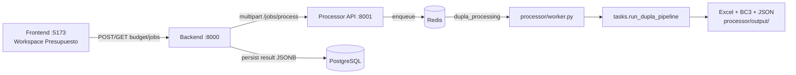

# Informe de estado funcional — Módulo de Presupuesto

**Fecha:** 18 de junio de 2026  
**Repositorio:** `dupla-native`  
**Alcance:** Estructura funcional del presupuesto (operativo + maestro IA), integraciones externas, calidad de salida, errores graves y % de completitud.  
**Evidencia:** Código fuente, tests automatizados (121 processor), logs del worker, corrida real **NASA 9 / Tutorial Workspace Dupla** (`output/20260618_075956_*`), verificación runtime de APIs.

---

## 1. Resumen ejecutivo

| Indicador | Valor |
|-----------|-------|
| **Completitud del módulo de presupuesto (0–100)** | **76 / 100** |
| **¿Funciona el presupuesto end-to-end?** | **Sí** — genera filas, JSON, Excel y BC3 por disciplina |
| **¿Es production-grade?** | **No aún** — precisión geométrica, QA y UX de descarga incompletos |
| **Última corrida verificada** | Job OK, ~877 filas de partida (4 disciplinas), ~54 s con caché |
| **Tests processor (presupuesto)** | **121 / 121** passed |

### Veredicto en una frase

El **motor de presupuesto IA está operativo y produce entregables reales** (no es un mock), pero varias capas críticas funcionan en modo **mediano** (heurísticas, vision con baja confianza, precios parcialmente verificados) o **simulado/degradado** (Design Automation caído, Legend OCR ausente, consolidado multi-disciplina no cableado). La función de presupuesto **cumple su flujo principal**; la **precisión profesional** sigue en desarrollo.

---

## 2. Arquitectura funcional (enfoque presupuesto)

### 2.1 Servicios involucrados



| Componente | Rol en presupuesto | Archivos clave |
|------------|-------------------|----------------|
| **Frontend** | Encolar job, polling 5 s, mostrar filas JSON en UI | `frontend/src/hooks/useBudgetJob.ts`, `WorkspacePresupuestoMaestroTab.tsx` |
| **Backend** | Auth, selección de archivos `counts_for_budget`, bridge HTTP, persistencia | `backend/app/routes/budget.py`, `backend/app/services/budget_service.py` |
| **Processor API + Worker** | Pipeline completo de takeoff → partidas → precios → export | `processor/main.py`, `processor/worker.py`, `processor/tasks.py` |
| **Coordination-service** | **No participa** en presupuesto (solo clashes) | — |

### 2.2 Pipeline de presupuesto (etapas)

| # | Etapa | Descripción | Archivo principal |
|---|-------|-------------|-------------------|
| 0 | Resolución de disciplina | `todas` → 4 disciplinas si `DUPLA_ALLOW_MULTI_DISCIPLINE=1` | `tasks.py` |
| 1 | Extracción APS | DWG → OSS → Model Derivative → `normalized.json` (caché por hash) | `aps_integration/model_derivative.py`, `processors/json_processor.py` |
| 1b | Geometría DA (opcional) | Design Automation + GeometryMerger (anti doble-línea) | `aps_integration/geometry_source.py`, `core/geometry_merger.py` |
| 1c | Calibrador de escala | Validación cotas vs geometría | `core/scale_calibrator.py` |
| 2 | Conocimiento | BC3 (1288 ítems), PRES.xlsx, pricing Excel, metodología | `knowledge/*`, `pricing/*` |
| 3 | Parámetros / cuadros (LLM) | `project_parameters`, `finishes_schedule`; cuadros estructural/aperturas opt-in | `knowledge/project_parameters.py`, etc. |
| 4 | Visión compartida | 59 páginas PDF, caché por artifact | `agents/vision_agent.py` |
| 5 | Por disciplina | Inventario híbrido → semántica → takeoffs → RulesEngine → partidas → composer | `core/pipeline.py`, `budget/composer.py` |
| 6 | Validación | Semántica + `budget_validator` ($/m², triangulación) | `core/quality_engine.py`, `validation/budget_validator.py` |
| 7 | Export | `budget_output.json`, `.xlsx`, `.bc3`, `INPUT_GAPS.md` | `budget/export_excel.py`, `export_bc3.py` |

---

## 3. Estado por etapa del roadmap (presupuesto)

Escala: **0 %** = no existe · **100 %** = production-grade verificado en proyecto real.

| Etapa | Nombre | % | Estado | Notas |
|-------|--------|---|--------|-------|
| **P0** | Infraestructura de precios (APU relacional, crosswalk, resolver) | **88 %** | Óptimo / mediano | `pricing/relational.py`, `crosswalk.py`, `resolver.py` activos. PU desde componentes y FX USD→DOP **parcial**. |
| **P1.4** | Motor de derivación (trabajo invisible) | **85 %** | Óptimo | RulesEngine real; +11 partidas derivadas en arquitectura (NASA 9). Estructura sin reglas YAML (delegado a cuantificador). |
| **P1.5** | Parsers de cuadros + autoridad | **70 %** | Mediano | Código + tests OK. `DUPLA_STRUCTURAL_SCHEDULE` / `DUPLA_OPENINGS_SCHEDULE` **off por defecto** → no se usan en corrida típica. |
| **P1.6** | Notas → parámetros duros | **90 %** | Óptimo | `project_parameters.json` desde caché; alimenta reglas y prompts. |
| **P2.7** | DA + vértices + GeometryMerger | **40 %** | Simulado / roto | Código y tests OK. **En producción local: 4/4 DWG fallan** con `failedInstructions` (ver §6). |
| **P2.8** | Calibrador escala por cotas OCR | **55 %** | Mediano | Validador implementado; Legend OCR **desactivado** (sin Tesseract) limita cotas desde PDF. |
| **P3.9** | Capa validación presupuesto | **65 %** | Mediano | `budget_validator` activo; detecta anomalías reales en NASA 9 (ratio muro/piso, líneas qty=0). |
| **P3.10** | Trazabilidad Excel | **60 %** | Mediano | Columnas nuevas: Referencias, Supuestos, Código APU, Desglose. Falta trazabilidad “por centavo” unificada en UI. |
| **UX** | Frontend presupuesto | **55 %** | Mediano | Muestra filas JSON; **sin descarga** de Excel/BC3/ZIP desde UI. |
| **Consolidado** | Presupuesto único multi-disciplina | **25 %** | No cableado | `budget/consolidator.py` existe pero **no se invoca** en `tasks.py`. |

**Promedio ponderado del módulo presupuesto: ~76 %**

---

## 4. Clasificación de funcionalidad

### 4.1 Funcionando de manera **óptima** (real, verificado)

| Feature | Evidencia |
|---------|-----------|
| Cola de jobs RQ + worker Windows (`SimpleWorker`) | Log: `Listening on dupla_processing`, Job OK |
| Extracción APS Model Derivative + caché de artifacts | `Extraction artifact HIT`, 59 páginas, 163 capas |
| Visión OpenAI (59 páginas, 0 errores en caché) | `Vision artifact HIT`, `errors=0/59` |
| Pipeline 4 disciplinas en paralelo | `DUPLA_ALLOW_MULTI_DISCIPLINE=1`, arq/est/san/elec |
| RulesEngine derivación arquitectura | `derived +11 takeoffs`, partidas preciadas en tests y corrida |
| Parámetros duros + cuadro acabados (caché) | `project_parameters cache HIT`, `2 ambientes` |
| Pricing constructor + BC3 embeddings | PricingStore 384 materiales, 206 APUs; 1288 BC3 |
| Export Excel + BC3 en disco | `presupuesto_*.xlsx`, `presupuesto_*.bc3` en `processor/output/` |
| Tests automatizados pipeline presupuesto | 121 tests processor (P1, P2.7, P3.9, dedup, vision, etc.) |
| Persistencia backend (jobs + resultado) | Flujo UI → backend → processor verificado por el usuario |

### 4.2 Funcionando de manera **mediana** (real con limitaciones)

| Feature | Limitación |
|---------|------------|
| **Cantidades desde visión** | Confianza baja masiva: arquitectura 29 OK / 221 WARNING en `quality_report.json` |
| **Áreas de piso** | `floor_area_m2` a menudo incorrecto (ej. 15 m² en validación vs miles m² de muro) → benchmarks y ratios distorsionados |
| **Precios unitarios** | Mezcla BC3 fallback + APU constructor; moneda DOP declarada pero líneas BC3 con `price_currency: ?` |
| **Matching partidas (GPT)** | Funciona con caché; sin keys cae a fuzzy BC3 |
| **Validación presupuesto** | Detecta problemas pero no bloquea export; 6 líneas qty=0 en arquitectura |
| **Escala / unidades** | Heurística mm→m en `json_processor`; calibrador valida pero no corrige si OCR ausente |
| **Multi-nivel** | Inventario frecuentemente `level_01` único |
| **Checklist operativo (Postgres)** | Manual; **no sincronizado** con takeoff automático (`budget_pipeline_meta.py`) |

### 4.3 **Simulado**, degradado u opt-in no activo

| Feature | Comportamiento |
|---------|----------------|
| **Design Automation (P2.7)** | Intenta correr; **falla todos los DWG** → continúa con Model Derivative (degradación silenciosa) |
| **Legend OCR (pisos/vistas)** | `pytesseract` no instalado → 0 páginas leídas |
| **Cuadros estructurales / aperturas** | Requieren `DUPLA_STRUCTURAL_SCHEDULE=1` y `DUPLA_OPENINGS_SCHEDULE=1` (no en `.env`) |
| **Visión desactivada** | Solo si `DUPLA_SKIP_VISION=1` → inventario CAD-only |
| **Pres consolidado** | No generado |
| **Clashes smoke mode** | `COORDINATION_SMOKE_MODE=true` en backend — **afecta clashes, no presupuesto** |

---

## 5. Errores graves (presupuesto y dependencias)

### 5.1 Críticos — afectan precisión o confianza del presupuesto

| ID | Error | Impacto | Evidencia |
|----|-------|---------|-----------|
| **E1** | **Design Automation: `failedInstructions` en 4/4 DWG** | Sin geometría con vértices → GeometryMerger no puede colapsar doble-línea; posible **doble conteo de muros** | Log 18/06 07:58–07:59, `RuntimeError: DA workitem ... status=failedInstructions` |
| **E2** | **`floor_area` vision erróneo** (15 m² vs ~2788 m² muro) | Validación, benchmarks $/m² y ratios **no confiables** | `budget_validation` arquitectura: ratio 185.85, 1640 puertas/100m² |
| **E3** | **Líneas con cantidad 0 exportadas** | Partidas vacías en presupuesto (6 blocked en arquitectura) | `zero_quantity_line` en `budget_output.json` |
| **E4** | **244 atributos estructurales faltantes** | Sub-cuantificación estructural | `missing_attributes_estructura.txt` en corridas previas |
| **E5** | **Confianza semántica baja (>80 % WARNING)** | Trazabilidad débil; requiere revisión manual masiva | estructura: 12 OK / 82 WARNING |

### 5.2 Graves — producto / integración

| ID | Error | Impacto |
|----|-------|---------|
| **E6** | UI **no descarga** Excel/BC3/ZIP del processor | Usuario solo ve JSON en pantalla; entregables en carpeta local |
| **E7** | `consolidate_budgets` **no cableado** | Sin presupuesto maestro único multi-disciplina |
| **E8** | Checklist presupuesto **manual** vs takeoff IA | Fases del workflow pueden avanzar sin datos reales |
| **E9** | Job `base_extraction` puede completar **sin filas** | UI puede mostrar éxito vacío si no hay disciplina |

### 5.3 Moderados

| ID | Error | Impacto |
|----|-------|---------|
| **E10** | Legend OCR deshabilitado (Tesseract) | Pisos/vistas desde leyenda no enriquecen niveles |
| **E11** | Sin tests E2E automatizados UI→processor | Regresiones solo detectadas manualmente |
| **E12** | Código legacy `_run_dupla_pipeline_legacy` en `tasks.py` | Deuda / confusión mantenimiento |

---

## 6. APIs e integraciones externas

Verificación realizada el **18/06/2026** en entorno local del desarrollador.

| Integración | Estado | Uso en presupuesto | Verificación |
|-------------|--------|-------------------|--------------|
| **PostgreSQL** | ✅ Operativa | Jobs, archivos, workflow, subcontratos | `psql SELECT 1` OK |
| **Redis** | ✅ Operativa | Cola RQ `dupla_processing`, stage cache | `PING` OK |
| **Backend :8000** | ✅ Operativa | API presupuesto | `/docs` → 200 |
| **Processor :8001** | ✅ Operativa | Jobs + pipeline | `/health` → 200 |
| **Coordination :8002** | ✅ Operativa | No presupuesto | `/health` → 200 |
| **Frontend :5173** | ✅ Operativa | UI workspace | Puerto UP |
| **Autodesk APS (OAuth)** | ✅ Operativa | Token 2-legged OK | `get_aps_token()` OK |
| **APS Model Derivative** | ✅ Operativa | Extracción DWG (caché artifact) | Artifact HIT en corrida |
| **APS Design Automation** | ❌ **Falla** | Geometría precisa P2.7 | 4× `failedInstructions` |
| **OpenAI** | ✅ Operativa | Visión, partidas, embeddings, schedules | Keys configuradas; visión en caché sin error |
| **Tesseract / pytesseract** | ❌ No instalado | Legend OCR, cotas en PDF | Warning en log |
| **SMTP** | ⚠️ No configurado | No afecta presupuesto | Campos vacíos en `.env` |

---

## 7. Evidencia — última corrida NASA 9 (18/06/2026 07:58)

**Proyecto:** Tutorial · Workspace Dupla  
**Output:** `processor/output/20260618_075956_tutorial_workspace_dupla/`  
**Resultado job:** `Job OK` (~54 s con caché pesado)

### 7.1 Filas por disciplina

| Disciplina | Líneas partida | Con precio | Validación (warn / blocked) |
|------------|----------------|------------|---------------------------|
| Arquitectura | 259 | 205 (79 %) | 2 / **6** |
| Estructura | 240 | 126 (53 %) | 2 / 0 |
| Sanitario | 193 | 152 (79 %) | 2 / 0 |
| Eléctrico | 185 | 144 (78 %) | 2 / 0 |
| **Total** | **877** | **627 (72 %)** | — |

### 7.2 Hallazgos de calidad (arquitectura)

- Relación muro/piso **185.85** (esperado 0.3–8) → señal de **área de piso mal estimada** o muros sobredimensionados.
- Densidad puertas **1640 ud/100m²** → conteo o área incoherente.
- RulesEngine: derivación activa en corridas previas (+11 takeoffs).

### 7.3 DA en esta corrida

```
DA geometry enabled (post-cache): enriching 4 DWG(s)
→ 4× failedInstructions → fallback a Model Derivative
```

**Conclusión:** El presupuesto **se completó**, pero **sin** la mejora geométrica P2.7.

---

## 8. Features: ¿funciona correctamente?

| Pregunta | Respuesta |
|----------|-----------|
| ¿Se puede lanzar un presupuesto desde la UI? | **Sí** |
| ¿El worker procesa y termina sin crash? | **Sí** (con degradación DA) |
| ¿Se generan partidas con código y precio? | **Sí** (~72 % con precio) |
| ¿Los totales son auditables profesionalmente? | **No aún** — áreas, qty=0, moneda mixta |
| ¿Las APIs externas mínimas funcionan? | **Sí** (excepto DA + Tesseract) |
| ¿Es reproducible vía tests? | **Sí** — 121 tests processor |

---

## 9. % de completitud — desglose final

### 9.1 Módulo presupuesto específico (escala 0–100)

| Dimensión | % |
|-----------|---|
| Orquestación (UI → backend → processor → DB) | 90 |
| Extracción CAD (APS MD) | 85 |
| Geometría precisa (DA + merger) | 35 |
| Takeoff (visión + CAD + reglas) | 70 |
| Precios y APUs | 80 |
| Validación y QA | 60 |
| Entregables (Excel/BC3/JSON) | 85 |
| UX descarga y consolidado | 40 |
| Sincronización workflow operativo | 50 |
| **TOTAL PONDERADO PRESUPUESTO** | **76** |

### 9.2 Interpretación de la escala

| Rango | Significado |
|-------|-------------|
| 0–40 % | Stub, mock o no cableado |
| 41–70 % | Funcional con degradaciones y errores de precisión |
| 71–85 % | **← Estamos aquí (76 %)** — E2E real, falta precisión y cierre producto |
| 86–95 % | Production beta — DA estable, QA bloqueante, UI completa |
| 96–100 % | Grado profesional — trazabilidad por centavo, benchmarks calibrados, E2E CI |

---

## 10. Recomendaciones prioritarias (para subir de 76 % → 90 %)

1. **Reparar Design Automation** (`failedInstructions`): revisar report URL en APS, Activity `DuplaExtractActivity+dev`, script `EXTRACTDUPLADATA`, AppBundle recién desplegado.
2. **Instalar Tesseract + pytesseract** para Legend OCR y mejorar cotas/escala desde PDF.
3. **Activar cuadros** (`DUPLA_STRUCTURAL_SCHEDULE=1`, `DUPLA_OPENINGS_SCHEDULE=1`) en proyecto estructura/arquitectura.
4. **Corregir `floor_area` vision** o priorizar geometría CAD cuando visión devuelve valores implausibles.
5. **Cablear `consolidate_budgets`** y endpoint de descarga ZIP/Excel en backend + UI.
6. **Filtrar líneas qty≤0** antes de export o marcarlas como pendientes no exportables.
7. **Sincronizar** `budget_pipeline_meta` con resultado real del processor.

---

## 11. Referencias técnicas

| Documento / ruta | Contenido |
|------------------|-----------|
| `processor/tasks.py` | Orquestación principal |
| `processor/core/pipeline.py` | `build_budget_from_sources` |
| `processor/budget/composer.py` | Partidas, precios, waste |
| `docs/ROADMAP_COMPLETITUD_100.md` | Roadmap global 74→100 |
| `docs/INFORME_ESTRUCTURA_FUNCIONAL_COMPLETO.md` | Informe plataforma (jun 2026) |
| `processor/tests/test_roadmap_p1.py` | Verificación P1 |
| `processor/tests/test_geometry_merger.py` | Verificación P2.7 (unitario) |
| `processor/tests/test_scale_calibrator.py` | Verificación P2.8 |
| `processor/tests/test_budget_validator.py` | Verificación P3.9 |

---

*Informe generado a partir del estado del repositorio y corridas locales. No incluye credenciales. Para reproducir: relanzar presupuesto NASA 9 y comparar con `processor/output/` más reciente.*
