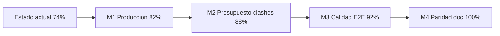

# Roadmap hacia 100% — Dupla Native

**Fecha:** 15 de junio de 2026  
**Estado actual:** 74 / 100 ([informe funcional](./INFORME_ESTRUCTURA_FUNCIONAL_COMPLETO.md))  
**Meta:** operación production-grade + paridad con el documento de negocio ([flujo-doc-vs-dupla](./modules/flujo-doc-vs-dupla.md))  
**Delta pendiente:** ~26 puntos porcentuales

---

## 1. Resumen ejecutivo

Este roadmap consolida **problemas a corregir**, **implementaciones faltantes** e **integraciones pendientes** para que Dupla funcione al **100%** según la definición de producto acordada.

### Qué significa «100% correcto sin errores»

| Incluye | No incluye |
|---------|------------|
| Flujos críticos sin estados engañosos (presupuesto, clashes, auth) | Cero bugs en perpetuidad |
| Integraciones externas verificadas antes de producción | Paridad con software comercial genérico fuera del doc |
| Guards de fase alineados con datos reales del backend | Supabase u otros stacks no previstos |
| CI + smoke E2E en pipelines clash y presupuesto | Cobertura 100% de líneas de código |
| Paridad funcional con `Flujo_Software_IA_Construccion.docx` | |

### Mapa de progreso

---

## 2. Diagnóstico por dominio

Brechas detectadas entre implementación actual y objetivo 100%.

| Dominio | % actual | Problema principal | Meta 100% |
|---------|----------|-------------------|-----------|
| Auth y sesión | 95% | SMTP/reset no verificado en prod | Reset email E2E + errores visibles |
| Proyectos y archivos | 88–90% | Clasificación IA superficial | Clasificación por contenido CAD |
| Clasificación / bootstrap | 55–90% | IA solo nombre/MIME | APS + visión + sub-estados workflow |
| Revisión arquitectura | 85% | — | Mantener + informe técnico auto |
| Pliego / especificaciones | 82% | Guards UX recientes OK | Estabilizar aprobaciones multi-fase |
| Clashes | 75% | Reanálisis manual engañoso | Re-run motor + workflow honesto |
| Presupuesto operativo | 65% | Checklist desacoplado takeoff | Sync automática con processor |
| Presupuesto maestro IA | 72% | `base_extraction` sin filas | Jobs incompletos no cuentan como éxito |
| Base de precios | 78% | Depende OpenAI | Health check + fallback documentado |
| Chat / colaboración | 90% | 500 intermitente en chat proyecto | Estabilidad + test regresión |
| Tablero / eventos | 88% | — | Mantener |
| Admin / dashboard | 72% | KPIs parciales | Dashboard doc §3 completo |
| DevOps / producción | 62% | Sin deploy CI; motor fuera CI | Pipeline deploy + CI ampliado |

---

## 3. Problemas graves a resolver

Consolidado de riesgos altos antes de considerar el producto «terminado».

### 3.1 Seguridad y producción

| # | Problema | Ubicación | Impacto |
|---|----------|-----------|---------|
| S1 | Reset password falla silenciosamente si SMTP inválido | `backend/app/services/email_service.py` | Usuarios bloqueados sin explicación |
| S2 | JWT secret demo en development | `backend/app/config.py` | Riesgo si se despliega sin rotar |
| S3 | Vulnerabilidad NuGet en extractor .NET APS | `processor/aps_integration/DuplaExtractor/` | Superficie de ataque en pipeline CAD |
| S4 | `DEV_EXPOSE_RESET_TOKEN` solo para dev | `backend/app/config.py` | No debe usarse en staging/prod |
| S5 | Sin pipeline de deploy automatizado | — | Despliegues manuales propensos a error |

### 3.2 Funcionalidad rota o engañosa

| # | Problema | Ubicación | Impacto |
|---|----------|-----------|---------|
| F1 | Checklist presupuesto manual sin validar takeoff | `backend/app/domain/budget_pipeline_meta.py` | Fases avanzan con datos falsos |
| F2 | Reanálisis clash no re-ejecuta motor Dupla | `backend/app/services/clash_workflow_service.py` | Usuario cree que re-detectó clashes |
| F3 | Job presupuesto `base_extraction` puede completar sin filas | `processor/main.py` | UI muestra éxito vacío |
| F4 | Clasificación IA solo nombre/MIME | `backend/app/services/project_file_ai_service.py` | Archivos mal clasificados |
| F5 | Chat proyecto `POST .../chat/conversation` intermitente 500 | `backend/app/routes/chat.py` | Widget pliego/proyecto falla |
| F6 | Smoke mode puede activarse y confundir QA | `coordination-service/wrapper/run_clash_analysis.py` | Demo parece producción |

### 3.3 Deuda técnica crítica

| # | Problema | Ubicación |
|---|----------|-----------|
| D1 | CI no ejecuta motor ni coordination-service | `.github/workflows/ci.yml` |
| D2 | Sin tests E2E automatizados clash/presupuesto | `scripts/test_clash_serena18.py` solo manual |
| D3 | Frontend: 3 tests Vitest vs 11 pestañas workspace | `frontend/src/**/*.test.*` |
| D4 | Módulos motor refactor pendientes | `motor/coordination/REFACTOR_LOG.md` |

---

## 4. Implementaciones faltantes (vs documento de negocio)

Fuente: [flujo-doc-vs-dupla.md](./modules/flujo-doc-vs-dupla.md)

| Feature doc | Estado actual | Implementación requerida |
|-------------|---------------|--------------------------|
| IA clasifica por contenido de plano | Parcial (nombre/MIME) | Pipeline APS + OpenAI sobre binario |
| Detección interferencias CAD | Clashes vía motor Dupla (parcial) | Informe técnico unificado + hallazgos OCR |
| Dos informes (técnico + documental) | Solo documental PDF heurístico | Generador informe técnico automático |
| Takeoff automático | Flags manuales | Sync checklist ↔ processor + guards fase |
| Dos presupuestos + informe económico | Pliego/export Excel | Informe económico consolidado PDF/Excel |
| Dashboard personalizado (KPIs, alertas) | KPIs parciales Gerencia | Ampliar `GET /api/dashboard/summary` |
| Estados granulares §18 | WorkflowPhase lineal | Sub-estados clasificación / análisis IA |
| Re-análisis clash por documento | Comentario UI pendiente | Endpoint dedicado + UI |
| Clasificación / análisis IA como fase visible | Mezclado en bootstrap/archivos | UX de sub-fase explícita |

---

## 5. Integraciones externas pendientes

| Integración | Estado | Acción para 100% |
|-------------|--------|------------------|
| PostgreSQL | Operativa | Mantener migraciones en CI |
| Redis | Operativa | Mantener |
| Processor `:8001` | Operativo | Health pre-job + tests E2E |
| Coordination `:8002` | Operativo | Entrar en CI |
| Motor `motor/` | En monorepo | Tests + módulos REFACTOR_LOG |
| Autodesk APS | Credenciales configuradas | Script health OAuth + bucket + derivative |
| OpenAI | API key configurada | Script health + manejo 503 claro en UI |
| SMTP | Variable configurada; entrega no verificada | Test E2E reset password staging |
| Supabase | No usado | Fuera de alcance |

---

## 6. Calidad y operación pendiente

| Área | Actual | Objetivo |
|------|--------|----------|
| Backend tests | 103 passed | Mantener + ampliar clash/budget workflow |
| Processor tests | 93 passed | Mantener + BC3 edge cases |
| Frontend tests | 3 archivos | Smoke por pestaña workspace |
| Coordination tests | 1 archivo | Suite wrapper + report_mapper |
| Motor tests | 1 archivo | Extracción + clash core |
| CI | backend + processor + frontend | + coordination + motor |
| E2E | Manual (`test_clash_serena18.py`) | Playwright nightly o CI optional |
| Backend `/health` | No existe (solo `/docs`) | Endpoint agregado |
| Deploy | Manual | GitHub Actions → staging/prod |

---

## 7. Grupo A — Prioridades

**Criterio:** impacto **alto** en producción, integridad de datos o UX que induce error grave.  
**Estimación:** S = 1–3 días · M = 1–2 semanas · L = 3+ semanas

---

### A-01. SMTP y reset password operativo

- **Problema:** Si SMTP falla, `EmailService` registra warning y retorna sin notificar al usuario; en dev se depende de `DEV_EXPOSE_RESET_TOKEN`.
- **Impacto:** Alto
- **Archivos:** `backend/app/services/email_service.py`, `backend/app/routes/auth.py`, `backend/.env.example`
- **Criterio de aceptación:**
  - Staging: reset password envía email real verificado.
  - API devuelve error 503/502 explícito si SMTP no configurado en prod.
  - Documentación de configuración SendGrid/similar en README.
- **Estimación:** M

---

### A-02. Sincronizar checklist presupuesto con processor

- **Problema:** Flags `subcontracts_done`, `volumetry_done`, `cost_analysis_done`, `budget_marked_complete` en `workflow_meta.budget_pipeline` son manuales; solo `volumetry_done` se sincroniza parcialmente al completar job.
- **Impacto:** Alto
- **Archivos:** `backend/app/domain/budget_pipeline_meta.py`, `backend/app/services/budget_service.py`, `frontend/src/components/project-workspace/tabs/WorkspaceFlujoTab.tsx`
- **Criterio de aceptación:**
  - Al completar job presupuesto con filas válidas → `volumetry_done` + `cost_analysis_done` automáticos.
  - Checkboxes manuales deshabilitados o sobrescritos cuando el estado del job lo contradice.
  - Transición a `BUDGET_APPROVED` bloqueada si checklist no refleja job completado.
- **Estimación:** M
- **Depende de:** A-10

---

### A-03. Reanálisis clash real (re-ejecutar motor)

- **Problema:** `request_reanalysis()` en `clash_workflow_service` registra outcome manual del revisor; no re-encola job en coordination-service.
- **Impacto:** Alto
- **Archivos:** `backend/app/services/clash_workflow_service.py`, `backend/app/services/clash_service.py`, `frontend/src/components/clash-workflow/ClashWorkflowPanel.tsx`
- **Criterio de aceptación:**
  - Acción «Solicitar reanálisis» encola nuevo job clash con DWG actualizados.
  - UI distingue «revisión manual» vs «nuevo análisis geométrico».
  - Reporte actualizado con `analysis_mode: real` y timestamp nuevo.
- **Estimación:** L
- **Depende de:** A-05, A-07

---

### A-04. Estabilizar chat conversación por proyecto

- **Problema:** `POST /api/projects/{uuid}/chat/conversation` reportado con 500 intermitente (Strict Mode / race / error no manejado).
- **Impacto:** Alto
- **Archivos:** `backend/app/routes/chat.py`, `backend/app/services/chat_service.py`, `frontend/src/components/project-workspace/PliegoProjectChatSnippet.tsx`
- **Criterio de aceptación:**
  - Test de regresión backend que crea/obtiene conversación idempotente.
  - Sin 500 en doble mount React Strict Mode.
  - Error 4xx/5xx con mensaje claro en UI.
- **Estimación:** M

---

### A-05. CI: motor + coordination-service

- **Problema:** Regresiones en `run_clash_analysis.py` y `report_mapper` no se detectan en PRs.
- **Impacto:** Alto
- **Archivos:** `.github/workflows/ci.yml`, `coordination-service/tests/`, `motor/tests/`
- **Criterio de aceptación:**
  - Job `coordination-test` ejecuta pytest en coordination-service.
  - Job `motor-test` ejecuta pytest en motor (mínimo smoke imports + flatten).
  - Falla el PR si alguno falla.
- **Estimación:** S

---

### A-06. E2E smoke automatizado (clash + presupuesto)

- **Problema:** Solo existe script manual `scripts/test_clash_serena18.py`; presupuesto sin E2E en CI.
- **Impacto:** Alto
- **Archivos:** `scripts/test_clash_serena18.py`, nuevo `scripts/e2e/` o workflow nightly
- **Criterio de aceptación:**
  - Pipeline nightly o CI optional con fixtures DWG pequeños.
  - Flujo: login → encolar clash → poll → reporte no vacío OR smoke explícito.
  - Flujo: login → encolar presupuesto → poll → filas > 0 OR estado `incomplete` claro.
- **Estimación:** L
- **Depende de:** A-05, A-07

---

### A-07. Health checks de integraciones externas

- **Problema:** No hay verificación previa de APS, OpenAI ni SMTP antes de jobs largos.
- **Impacto:** Alto
- **Archivos:** nuevo `backend/app/routes/health.py` o `scripts/check_integrations.py`
- **Criterio de aceptación:**
  - Endpoint `GET /api/health/integrations` (solo Gerencia) retorna estado APS/OpenAI/SMTP/processor/coordination.
  - UI pestaña Hallazgos/Presupuesto muestra banner si APS/OpenAI down.
  - Documentado en `backend/.env.example`.
- **Estimación:** M

---

### A-08. Hardening seguridad producción

- **Problema:** Secretos demo, smoke mode, NuGet vulnerable en extractor APS.
- **Impacto:** Alto
- **Archivos:** `backend/app/config.py`, `processor/aps_integration/DuplaExtractor/`, checklist deploy en README
- **Criterio de aceptación:**
  - Checklist pre-deploy verificado (JWT, APP_ENV, COORDINATION_SMOKE_MODE=false).
  - `System.Text.Json` actualizado en DuplaExtractor; rebuild documentado.
  - `DEV_EXPOSE_RESET_TOKEN=false` en staging/prod.
- **Estimación:** M
- **Depende de:** A-01

---

### A-09. Guards de fase alineados con presupuesto real

- **Problema:** Proyecto puede avanzar fases con checklist marcado manualmente sin takeoff válido.
- **Impacto:** Alto
- **Archivos:** `backend/app/services/project_lifecycle_service.py`, `backend/app/domain/budget_pipeline_meta.py`
- **Criterio de aceptación:**
  - `MANAGEMENT_APPROVAL` → `BUDGET_APPROVED` requiere job presupuesto completado con filas.
  - `control_review_done` no editable si job incompleto.
  - Mensaje 409 descriptivo en API.
- **Estimación:** M
- **Depende de:** A-02, A-10

---

### A-10. Validar jobs `base_extraction` e incompletos

- **Problema:** Processor puede devolver `completed_partial` / `base_extraction` sin filas; UI/backend pueden tratarlo como éxito.
- **Impacto:** Alto
- **Archivos:** `processor/main.py`, `backend/app/services/budget_service.py`, `frontend/src/hooks/useBudgetJob.ts`, `WorkspacePresupuestoMaestroTab.tsx`
- **Criterio de aceptación:**
  - Estado job `incomplete` propagado al frontend.
  - No se marca `volumetry_done` si filas = 0.
  - Botón «Iniciar presupuesto» muestra causa (falta APS, OpenAI, archivos).
- **Estimación:** M

---

## 8. Grupo B — Resto

**Criterio:** paridad documento de negocio, calidad extendida, deuda técnica no bloqueante inmediata.

---

### B-01. Clasificación IA por contenido CAD

- **Problema:** `ProjectFileAIService` usa solo nombre de archivo y MIME.
- **Impacto:** Medio
- **Archivos:** `backend/app/services/project_file_ai_service.py`, `backend/app/services/aps_derivative_pipeline.py`, `backend/app/services/project_file_classification_service.py`
- **Criterio de aceptación:** Subida DWG dispara clasificación APS + OpenAI; disciplina persistida con confianza.
- **Estimación:** L
- **Depende de:** A-07

---

### B-02. Informe técnico automático

- **Problema:** Solo existe informe documental PDF heurístico; doc pide dos informes.
- **Impacto:** Medio
- **Archivos:** `backend/app/services/export_service.py`, rutas en `projects.py`
- **Criterio de aceptación:** `GET .../exports/technical-report.pdf` con hallazgos clash + checklist + archivos.
- **Estimación:** L
- **Depende de:** A-03

---

### B-03. Dashboard KPIs ampliado

- **Problema:** Dashboard Gerencia parcial vs doc §3 (tareas, alertas, KPIs por rol).
- **Impacto:** Medio
- **Archivos:** `backend/app/routes/dashboard.py`, `frontend/src/pages/DashboardPage.tsx`
- **Criterio de aceptación:** KPIs: proyectos por fase, clashes abiertos, jobs presupuesto pendientes, tareas Kanban vencidas.
- **Estimación:** M

---

### B-04. Parser BC3 FIEBDC completo

- **Problema:** Export BC3 falla en descomposiciones complejas FIEBDC.
- **Impacto:** Medio
- **Archivos:** `processor/processors/bc3_parser.py`, `processor/budget/export_bc3.py`
- **Criterio de aceptación:** Tests con fixtures FIEBDC reales; export sin truncar partidas anidadas.
- **Estimación:** L

---

### B-05. Informe económico unificado (dos presupuestos doc)

- **Problema:** Doc §8–11 pide dos presupuestos + informe económico; solo pliego/export Excel parcial.
- **Impacto:** Medio
- **Archivos:** `backend/app/services/export_service.py`, templates Excel/PDF
- **Criterio de aceptación:** Export consolidado: presupuesto maestro + subcontratos + resumen gerencia PDF.
- **Estimación:** L
- **Depende de:** A-02

---

### B-06. Re-análisis clash por documento

- **Problema:** UI comentada «pendiente de endpoint dedicado» en `WorkspaceHallazgosTab.tsx`.
- **Impacto:** Medio
- **Archivos:** `frontend/.../WorkspaceHallazgosTab.tsx`, `backend/app/routes/clash.py`
- **Criterio de aceptación:** Endpoint `POST .../clash/jobs/reanalyze-file` con `file_uuid`; job acotado a un DWG.
- **Estimación:** M
- **Depende de:** A-03

---

### B-07. Tiles clash reales (eliminar placeholder SVG)

- **Problema:** `clash_tile_placeholder.py` genera SVG si motor no produjo tiles.
- **Impacto:** Bajo
- **Archivos:** `backend/app/services/clash_tile_placeholder.py`, motor reporting
- **Criterio de aceptación:** Placeholder solo en dev; prod exige tiles del motor o estado «sin imagen» explícito.
- **Estimación:** M

---

### B-08. Módulos motor faltantes (REFACTOR_LOG)

- **Problema:** 9+ módulos listados en REFACTOR_LOG no existen (`pipeline_config`, `layer_rules`, `delivery_qa`, etc.).
- **Impacto:** Medio
- **Archivos:** `motor/coordination/REFACTOR_LOG.md`, nuevos módulos bajo `motor/coordination/`
- **Criterio de aceptación:** Módulos críticos implementados o REFACTOR_LOG actualizado con decisión explícita de no implementar.
- **Estimación:** L

---

### B-09. Sub-estados workflow (clasificación / análisis IA)

- **Problema:** Doc §18 tiene estados granulares; Dupla usa fase lineal sin sub-estados visibles.
- **Impacto:** Medio
- **Archivos:** `backend/app/domain/workflow_phase.py`, `frontend/src/constants/workflowDocMapping.ts`, UI flujo
- **Criterio de aceptación:** UI muestra sub-estado dentro de AWAITING_FILES / bootstrap; transiciones documentadas.
- **Estimación:** L

---

### B-10. Integración entrega planos SDP con fases

- **Problema:** `WorkspaceEntregaPlanosTab` CRUD aislado del flujo de fases.
- **Impacto:** Bajo
- **Archivos:** `WorkspaceEntregaPlanosTab.tsx`, `project_lifecycle_service.py`
- **Criterio de aceptación:** Entregas SDP bloquean/desbloquean transición según estado filas.
- **Estimación:** M

---

### B-11. Limpieza código muerto

- **Problema:** Mocks y pestaña huérfana confunden mantenimiento.
- **Impacto:** Bajo
- **Archivos:** `frontend/src/data/mockStructuralAnalysisReport.ts`, `frontend/src/lib/projectMasterBudgetDemo.ts`, `WorkspacePresupuestoTab.tsx`
- **Criterio de aceptación:** Archivos eliminados o movidos a `__fixtures__`; grep sin imports rotos.
- **Estimación:** S

---

### B-12. Tests frontend ampliados + `/health` backend

- **Problema:** 3 tests Vitest; backend sin `/health` dedicado.
- **Impacto:** Medio
- **Archivos:** `frontend/src/**`, `backend/app/main.py`
- **Criterio de aceptación:** Smoke test por pestaña workspace crítica; `GET /health` retorna 200 + versión.
- **Estimación:** M

---

### B-13. Extracción accore Windows — documentación de plataforma

- **Problema:** `from_dwg_accore.py` lanza `NotImplementedError` fuera de Windows.
- **Impacto:** Bajo
- **Archivos:** `motor/coordination/extraction/from_dwg_accore.py`, README, GUIA_FLUJO_CLASHES
- **Criterio de aceptación:** Matriz plataforma documentada: Windows accore / macOS-Linux APS obligatorio.
- **Estimación:** S

---

### B-14. Tours y documentación alineados con producto

- **Problema:** `productTours.ts` y docs antiguos describen presupuesto como demo.
- **Impacto:** Bajo
- **Archivos:** `frontend/src/constants/productTours.ts`, `docs/README.md`
- **Criterio de aceptación:** Tours reflejan presupuesto IA y clashes reales; fechas doc actualizadas.
- **Estimación:** S

---

### B-15. Pipeline deploy staging/producción

- **Problema:** Despliegue manual; sin GitHub Actions deploy.
- **Impacto:** Medio
- **Archivos:** nuevo `.github/workflows/deploy.yml`, README producción
- **Criterio de aceptación:** Deploy staging automático desde `main`; checklist secrets; migrate + seed opcional.
- **Estimación:** L
- **Depende de:** A-08

---

### B-16. Política multi-disciplina presupuesto + UX

- **Problema:** `DUPLA_ALLOW_MULTI_DISCIPLINE=0` bloquea `todas`; UX no explica por qué.
- **Impacto:** Medio
- **Archivos:** `processor/.env.example`, `WorkspacePresupuestoMaestroTab.tsx`, `processor/main.py`
- **Criterio de aceptación:** Decisión producto documentada; UI muestra coste/tiempo estimado; flag habilitable en prod con límites.
- **Estimación:** M

---

### B-17. Guardrails smoke mode en UI y docs

- **Problema:** Activar smoke puede inducir a creer que clashes son reales en todos los entornos.
- **Impacto:** Bajo
- **Archivos:** `WorkspaceHallazgosTab.tsx`, `scripts/dev.sh`, `INTEGRACION_FEAT_CLASHES.md`
- **Criterio de aceptación:** Banner persistente en dev si smoke=true; README y dev.sh mensaje al arrancar.
- **Estimación:** S

---

### B-18. Pipeline hallazgos técnicos automáticos (OCR/reglas)

- **Problema:** `project_technical_findings` es manual; doc fase 4–5 planeaba CV/BIM.
- **Impacto:** Medio
- **Archivos:** `backend/app/models/`, rutas `technical-findings`, processor
- **Criterio de aceptación:** Reglas mínimas auto-generan hallazgos desde clash report + checklist incompleto.
- **Estimación:** L
- **Depende de:** B-02

---

## 9. Hitos sugeridos

Orden recomendado de ejecución con completitud acumulada estimada.

### M1 — Producción confiable (~82%)

**Tareas:** A-01, A-07, A-08  
**Entregables:**

- Reset password verificado en staging
- Health checks integraciones
- Checklist deploy + patch NuGet

**Duración estimada:** 2–3 semanas

---

### M2 — Presupuesto y clashes honestos (~88%)

**Tareas:** A-02, A-03, A-09, A-10  
**Entregables:**

- Checklist sync con processor
- Reanálisis clash real
- Guards fase + jobs incompletos visibles

**Duración estimada:** 3–5 semanas  
**Depende de:** M1 (A-07)

---

### M3 — Calidad automatizada (~92%)

**Tareas:** A-04, A-05, A-06  
**Entregables:**

- Chat proyecto estable
- CI motor + coordination
- E2E smoke nightly

**Duración estimada:** 2–4 semanas  
**Depende de:** M2 parcial

---

### M4 — Paridad documento de negocio (~100%)

**Tareas:** B-01, B-02, B-03, B-05, B-09 (+ selección B-04, B-08 según capacidad)  
**Entregables:**

- Clasificación CAD real
- Informes técnico + económico
- Dashboard KPIs completo
- Sub-estados workflow visibles

**Duración estimada:** 8–12 semanas  
**Depende de:** M1, M2, M3

---

## 10. Matriz resumen Grupo A vs B

| ID | Título | Grupo | Estimación | Hito |
|----|--------|-------|------------|------|
| A-01 | SMTP reset password | A | M | M1 |
| A-02 | Sync checklist presupuesto | A | M | M2 |
| A-03 | Reanálisis clash real | A | L | M2 |
| A-04 | Chat proyecto estable | A | M | M3 |
| A-05 | CI motor + coordination | A | S | M3 |
| A-06 | E2E smoke automatizado | A | L | M3 |
| A-07 | Health checks integraciones | A | M | M1 |
| A-08 | Hardening seguridad prod | A | M | M1 |
| A-09 | Guards fase presupuesto | A | M | M2 |
| A-10 | Validar base_extraction | A | M | M2 |
| B-01 | Clasificación CAD | B | L | M4 |
| B-02 | Informe técnico auto | B | L | M4 |
| B-03 | Dashboard KPIs | B | M | M4 |
| B-04 | Parser BC3 FIEBDC | B | L | M4 |
| B-05 | Informe económico | B | L | M4 |
| B-06 | Re-análisis por documento | B | M | — |
| B-07 | Tiles clash reales | B | M | — |
| B-08 | Módulos motor REFACTOR_LOG | B | L | — |
| B-09 | Sub-estados workflow | B | L | M4 |
| B-10 | SDP integración fases | B | M | — |
| B-11 | Limpieza código muerto | B | S | — |
| B-12 | Tests frontend + /health | B | M | — |
| B-13 | Doc plataforma accore | B | S | — |
| B-14 | Tours y docs | B | S | — |
| B-15 | Deploy pipeline | B | L | post-M1 |
| B-16 | Multi-disciplina UX | B | M | — |
| B-17 | Guardrails smoke mode | B | S | — |
| B-18 | Hallazgos técnicos auto | B | L | M4 |

---

## 11. Referencias

| Documento | Uso |
|-----------|-----|
| [INFORME_ESTRUCTURA_FUNCIONAL_COMPLETO.md](./INFORME_ESTRUCTURA_FUNCIONAL_COMPLETO.md) | Estado actual 74% |
| [modules/flujo-doc-vs-dupla.md](./modules/flujo-doc-vs-dupla.md) | Paridad doc negocio |
| [INTEGRACION_FEAT_CLASHES.md](./INTEGRACION_FEAT_CLASHES.md) | Pipeline clashes |
| [TECHNICAL.md](./TECHNICAL.md) | Arquitectura y env vars |
| [motor/coordination/REFACTOR_LOG.md](../motor/coordination/REFACTOR_LOG.md) | Deuda motor |
| [.github/workflows/ci.yml](../.github/workflows/ci.yml) | CI actual |

---

*Roadmap vivo: actualizar porcentajes e IDs al cerrar cada tarea. Grupo A debe completarse antes de declarar producción; Grupo B cierra la paridad funcional al 100%.*
